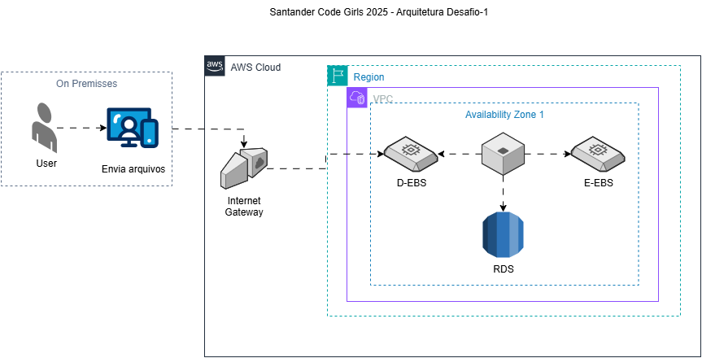

# Bootcamp Santander Code Girls - 2025
Curso preparatorio com aulas teoricas e praticas para alcançar a certificação CLF-02 AWS.

### Sobre o repositório 🪣
Aqui terão algumas anotações e os desafios realizados durante o bootcamp.

### Desafios📚
✔️ *1º Desafio:*  Arquitetura Instâncias EC2 na AWS.

 

* A proposta foi criar um diagrama via Draw.io com o serviços EC2 e EBS da AWS (envio e recebimento de arquivos) conforme figura acima.

